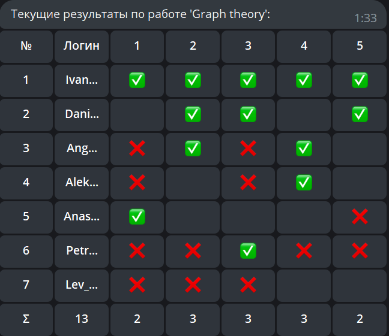

# Телеграм бот для удобного администрирования системы сдачи и проверки задач

## Немного о том, что может этот бот

При помощи этого бота любой человек сможет реализовать систему сдачи и проверки задач
всего за пару нажатий. Пробежимся по его возможностям:

1) Добавление домашних заданий - на данный момент функциональность бота ограничивается только сдачей задач, 
поэтому домашняя работа задается количеством заданий и набором правильных ответов
2) Добавление/удаление пользователей с различными ролями - админы и простые ~~смертные~~ ученики

3) Просмотр информации о каждом домашнем задании или пользователе - для домашнего задания бот покажет правильные ответы
и красивую таблицу результатов. А для пользователя - его логин, пароль, никнейм в телеграме. Более того, для ученика бот покажет табличку, 
отображающую все результаты сдачи задач этим человеком. Таким образом, учителю можно легко следить за успеваемостью его учеников.

4) Все админы будут получать уведомления о том, что их ученик сдал очередную задачу

5) Ученик имеет интерфейс для выбора задачи, которую он хочет сдать

## Как запускать бота?

Запуск бота предельно прост. Необходимо в корневой директории проекта создать файл config.py, внутри которого надо создать 
переменную **TELEGRAM_TOKEN**, которая обозначает телеграм токен вашего бота (токен возвращает https://t.me/BotFather).
Таким образом, файл **config.py** должен состоять из одной строки и иметь такой вид:

`TELEGRAM_TOKEN = "YOUR_TOKEN_HERE"`

После этой процедуры необходимо в файле [constants.py](./constants.py) задать свои значения переменным **SUPER_ADMIN_LOGIN**
и **SUPER_ADMIN_PASSWORD**, которые будут обозначать логин и пароль от аккаунта супер-админа. 

Теперь надо запустить файл [main.py](./main.py). Вуаля, бот готов к работе!